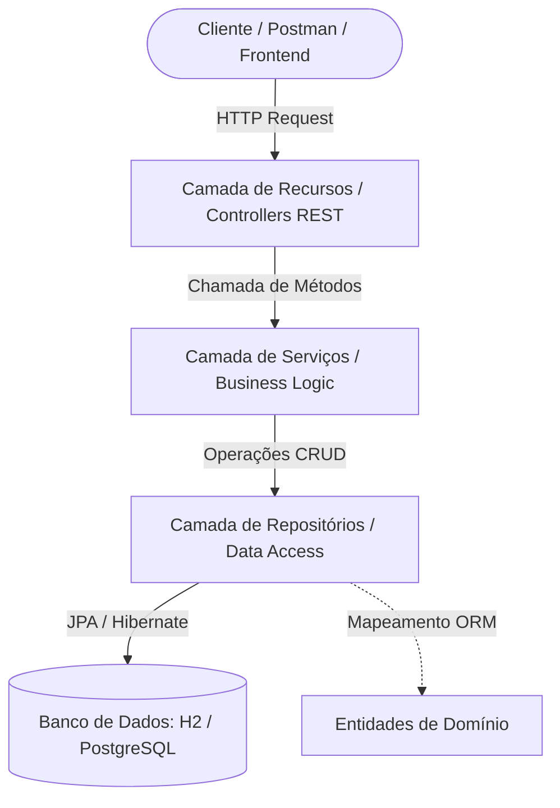
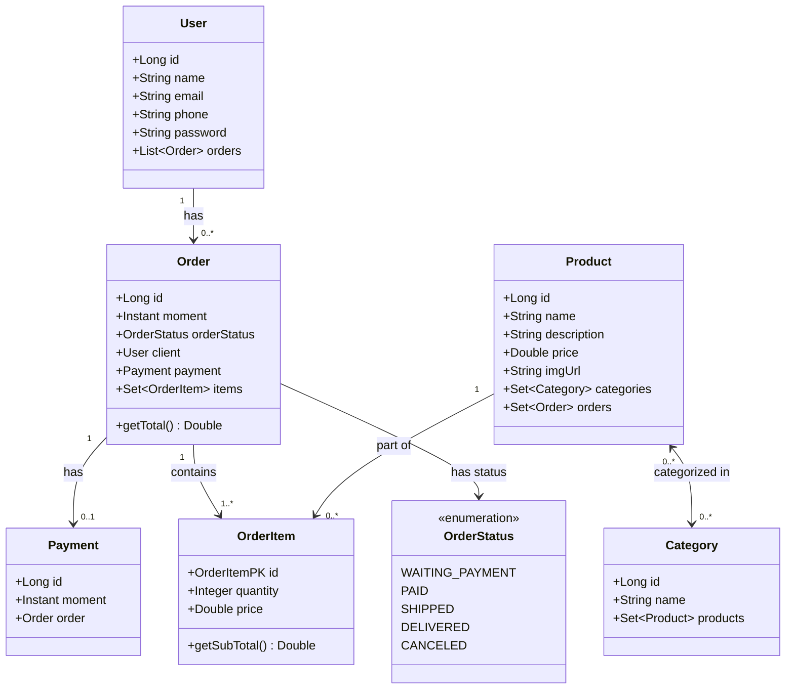

# 🚀 Spring Boot Web Services & JPA

Uma API RESTful desenvolvida com **Java** e **Spring Boot**, aplicando os conceitos de **Mapeamento Objeto-Relacional (ORM)** com **JPA / Hibernate**, arquitetura em camadas, tratamento customizado de exceções e persistência em banco de dados (H2 Database e PostgreSQL).

---

## 📋 Sumário
- [Sobre o Projeto](#-sobre-o-projeto)
- [Tecnologias Utilizadas](#-tecnologias-utilizadas)
- [Arquitetura do Sistema](#-arquitetura-do-sistema)
- [Modelo de Domínio](#-modelo-de-domínio)
- [Estrutura de Arquivos e Pastas](#-estrutura-de-arquivos-e-pastas)
- [Endpoints da API](#-endpoints-da-api)
- [Tratamento de Exceções](#-tratamento-de-exceções)
- [Perfis de Configuração (Profiles)](#-perfis-de-configuração-profiles)
- [Como Executar a Aplicação](#-como-executar-a-aplicação)

---

## 📖 Sobre o Projeto

Este projeto é uma API de gerenciamento de pedidos e comércio eletrônico que permite gerenciar usuários, categorias, produtos, pedidos e pagamentos. 

### Principais Funcionalidades:
- **CRUD completo de Usuários** (Criação, Leitura, Atualização e Deleção).
- **Consulta de Produtos e Categorias** com relacionamento N:N (Muitos-para-Muitos).
- **Consulta de Pedidos** com associação de cliente, itens do pedido, status e pagamento.
- **Cálculo automático de subtotais e totais** para itens de pedido e pedidos.
- **Seeding automático de dados** no perfil de teste (`test`).
- **Tratamento global e padronizado de exceções** na camada REST.

---

## 🛠️ Tecnologias Utilizadas

- **Linguagem:** Java 25
- **Framework:** Spring Boot 4.x
  - **Spring Data JPA:** Abstração e facilitação da camada de persistência.
  - **Spring Web:** Criação de serviços e endpoints RESTful (MVC).
  - **Hibernate:** Implementação do ORM JPA.
- **Bancos de Dados:**
  - **H2 Database:** Banco em memória para testes e prototipação rápida.
  - **PostgreSQL:** Banco de dados relacional para ambiente de desenvolvimento.
- **Gerenciador de Dependências:** Apache Maven

---

## 🏛️ Arquitetura do Sistema

A aplicação adota o padrão de **Arquitetura em Camadas (Layered Architecture)** para garantir a separação de responsabilidades e manutenibilidade do código:



1. **Resource Layer (Controladores REST):** Responsável por expor os endpoints HTTP, receber requisições, serializar/desserializar dados e retornar respostas HTTP (`ResponseEntity`).
2. **Service Layer (Regras de Negócio):** Contém a lógica de negócio, orquestração e chamadas aos repositórios.
3. **Repository Layer (Acesso a Dados):** Interfaces que estendem `JpaRepository` para interagir diretamente com o banco de dados.
4. **Domain Layer (Entidades):** Classes anotadas com `@Entity` que representam as tabelas e relacionamentos do banco.

---

## 📊 Modelo de Domínio

O diagrama conceitual abaixo representa as entidades do sistema e seus relacionamentos:



---

## 📂 Estrutura de Arquivos e Pastas

A estrutura organizacional do projeto segue as melhores práticas do ecossistema Spring Boot:

```
springproject/
├── .mvn/                                      # Arquivos de suporte do Maven Wrapper
├── src/
│   ├── main/
│   │   ├── java/com/exemple/springproject/
│   │   │   │
│   │   │   ├── config/                        # Classes de configuração da aplicação
│   │   │   │   └── TestConfig.java            # Seeding/população de dados para o perfil "test"
│   │   │   │
│   │   │   ├── entities/                      # Entidades de Domínio (JPA)
│   │   │   │   ├── Category.java              # Entidade Categoria de Produtos
│   │   │   │   ├── Order.java                 # Entidade Pedido
│   │   │   │   ├── OrderItem.java             # Entidade Item de Pedido (tabela associativa com atributos)
│   │   │   │   ├── Payment.java               # Entidade Pagamento (relação 1:1 com Pedido)
│   │   │   │   ├── Product.java               # Entidade Produto
│   │   │   │   ├── User.java                  # Entidade Usuário / Cliente
│   │   │   │   │
│   │   │   │   ├── enums/                     # Enumerações do domínio
│   │   │   │   │   └── OrderStatus.java       # Status do pedido (Aguardando Pagamento, Pago, etc.)
│   │   │   │   │
│   │   │   │   └── pk/                        # Chaves primárias compostas
│   │   │   │       └── OrderItemPK.java       # Chave primária composta (Order + Product)
│   │   │   │
│   │   │   ├── repositories/                  # Interfaces de acesso a dados (Spring Data JPA)
│   │   │   │   ├── CategoryRepository.java    # Repositório de Categoria
│   │   │   │   ├── OrderItemRepository.java   # Repositório de Item de Pedido
│   │   │   │   ├── OrderRepository.java       # Repositório de Pedido
│   │   │   │   ├── ProductRepository.java     # Repositório de Produto
│   │   │   │   └── UserRepository.java        # Repositório de Usuário
│   │   │   │
│   │   │   ├── resources/                     # Controladores REST (Controllers / Endpoints)
│   │   │   │   ├── CategoryResource.java      # Endpoints HTTP para /categories
│   │   │   │   ├── OrderResouce.java          # Endpoints HTTP para /orders
│   │   │   │   ├── ProductResouce.java        # Endpoints HTTP para /products
│   │   │   │   ├── UserResource.java          # Endpoints HTTP para /users
│   │   │   │   │
│   │   │   │   └── exceptions/                # Manipulação de erros na camada REST
│   │   │   │       ├── ResourceExceptionHandler.java  # Interceptador global (@ControllerAdvice)
│   │   │   │       └── StandardError.java             # Formato padronizado de erro HTTP
│   │   │   │
│   │   │   ├── services/                      # Regras de Negócio (Camada de Serviço)
│   │   │   │   ├── CategoryService.java       # Serviços e operações de Categoria
│   │   │   │   ├── OrderService.java          # Serviços e operações de Pedido
│   │   │   │   ├── ProductService.java        # Serviços e operações de Produto
│   │   │   │   ├── UserService.java           # Serviços e operações de Usuário
│   │   │   │   │
│   │   │   │   └── exceptions/                # Exceções personalizadas de serviço
│   │   │   │       ├── DatabaseException.java         # Exceção para violações de integridade
│   │   │   │       └── ResourceNotFoundException.java # Exceção para recurso não encontrado (404)
│   │   │   │
│   │   │   └── SpringprojectApplication.java  # Classe principal (Spring Boot Main Application)
│   │   │
│   │   └── resources/                         # Arquivos de recursos e configurações
│   │       ├── application.properties         # Configuração geral da aplicação e perfil ativo
│   │       ├── application-test.properties    # Configurações do perfil "test" (H2 Database)
│   │       ├── application-dev.properties     # Configurações do perfil "dev" (PostgreSQL)
│   │       └── application-dev.properties.template # Template para credenciais do PostgreSQL
│   │
│   └── test/                                  # Testes unitários e de integração
│       └── java/com/exemple/springproject/
│           └── SpringprojectApplicationTests.java
│
├── mvnw                                       # Executável Maven Wrapper (Linux / macOS)
├── mvnw.cmd                                   # Executável Maven Wrapper (Windows)
├── pom.xml                                    # Descritor do Maven e dependências do projeto
├── HELP.md                                    # Guia de referências gerado pelo Spring Initializr
└── README.md                                  # Documentação principal do projeto
```

---

## 📡 Endpoints da API

Abaixo estão listadas as rotas REST disponíveis na aplicação:

### 👤 Usuários (`/users`)
| Método | Rota | Descrição | Status de Sucesso |
|---|---|---|---|
| `GET` | `/users` | Retorna todos os usuários cadastrados | `200 OK` |
| `GET` | `/users/{id}` | Retorna um usuário pelo ID | `200 OK` |
| `POST` | `/users` | Cadastra um novo usuário | `201 Created` |
| `PUT` | `/users/{id}` | Atualiza dados de um usuário existente | `200 OK` |
| `DELETE` | `/users/{id}` | Remove um usuário pelo ID | `204 No Content` |

#### Exemplo de Payload para Criação / Atualização de Usuário (`POST` / `PUT`):
```json
{
  "name": "Maria Brown",
  "email": "maria@gmail.com",
  "phone": "988888888",
  "password": "secretpassword"
}
```

---

### 📦 Pedidos (`/orders`)
| Método | Rota | Descrição | Status de Sucesso |
|---|---|---|---|
| `GET` | `/orders` | Retorna todos os pedidos com itens, cliente e pagamento | `200 OK` |
| `GET` | `/orders/{id}` | Retorna um pedido específico pelo ID | `200 OK` |

---

### 🏷️ Produtos (`/products`)
| Método | Rota | Descrição | Status de Sucesso |
|---|---|---|---|
| `GET` | `/products` | Retorna todos os produtos e suas categorias | `200 OK` |
| `GET` | `/products/{id}` | Retorna um produto específico pelo ID | `200 OK` |

---

### 📂 Categorias (`/categories`)
| Método | Rota | Descrição | Status de Sucesso |
|---|---|---|---|
| `GET` | `/categories` | Retorna todas as categorias cadastradas | `200 OK` |
| `GET` | `/categories/{id}` | Retorna uma categoria específica pelo ID | `200 OK` |

---

## ⚠️ Tratamento de Exceções

A aplicação conta com um manipulador global de exceções (`@ControllerAdvice` em `ResourceExceptionHandler`), padronizando o retorno de erros no formato JSON estruturado por meio da classe `StandardError`:

```json
{
  "timestamp": "2026-08-26T23:30:00Z",
  "status": 404,
  "error": "Resource not found",
  "message": "Resource not found. Id 99",
  "path": "/users/99"
}
```

- **`ResourceNotFoundException`** &rarr; Retorna status HTTP **404 Not Found**.
- **`DatabaseException`** &rarr; Retorna status HTTP **400 Bad Request** para erros de integridade referencial (ex: deletar usuário com pedidos atrelados).

---

## ⚙️ Perfis de Configuração (Profiles)

O arquivo `src/main/resources/application.properties` define o perfil ativo da aplicação:

```properties
spring.profiles.active=test
```

### 1. Perfil `test` (`application-test.properties`)
- Utiliza banco de dados **H2 em memória**.
- Console H2 habilitado em `http://localhost:8080/h2-console` (JDBC URL: `jdbc:h2:mem:testdb`, Usuário: `sa`, Senha: em branco).
- População automática de dados através da classe `TestConfig` na inicialização.

### 2. Perfil `dev` (`application-dev.properties`)
- Conecta a uma instância local do **PostgreSQL**.
- Requer a criação do banco de dados no PostgreSQL.
- O arquivo `application-dev.properties.template` pode ser usado como base para configurar suas próprias credenciais locais.

---

## 🚀 Como Executar a Aplicação

### Pré-requisitos
- **Java JDK 25** (ou versão compatível) instalado e configurado no `PATH`.
- **Git** instalado.
- *(Opcional)* **PostgreSQL** instalado (caso queira rodar no perfil `dev`).

### Passo a passo:

1. **Clone o repositório:**
   ```bash
   git clone https://github.com/samucaasantos/projectspringboot4-jpa.git
   cd projectspringboot4-jpa
   ```

2. **Configuração do perfil:**
   No arquivo `src/main/resources/application.properties`, configure o perfil desejado:
   ```properties
   spring.profiles.active=test
   ```

3. **Executar a aplicação:**
   - **Linux / macOS:**
     ```bash
     ./mvnw spring-boot:run
     ```
   - **Windows (PowerShell / CMD):**
     ```powershell
     .\mvnw.cmd spring-boot:run
     ```

4. **Acessar a aplicação:**
   - API: `http://localhost:8080`
   - Console H2 (quando no perfil `test`): `http://localhost:8080/h2-console`
